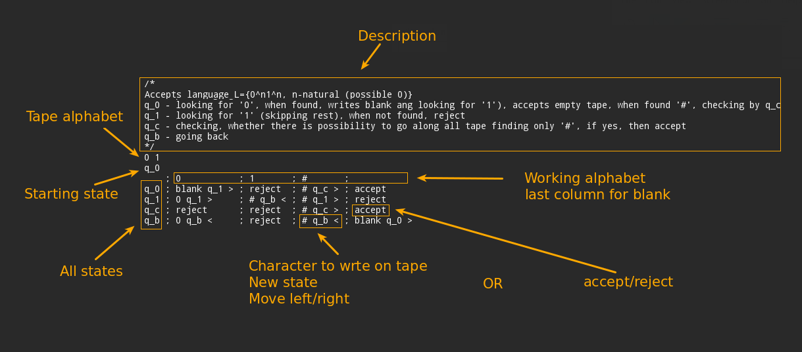
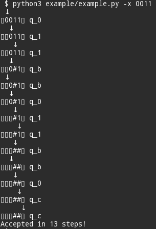
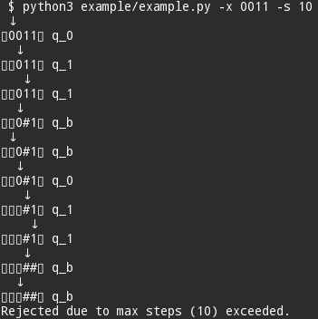
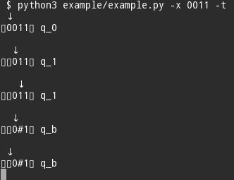
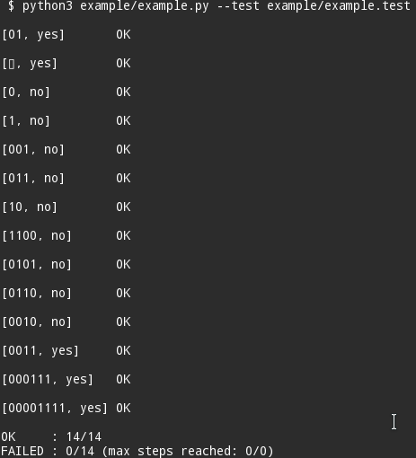

# Turing machine transcompiler and simulator
*Machine description to python3 program transcompiler.*

This project enables you to provide Turing machine using DSL (example below) and converts it to python3 program. Having the generated program you can freely run it to check if it accepts input words. You can also write some tests and quickly check how many of them passed or failed (due to rejection or exceeding configurable max-steps parameter).

The project was created in 2014 as a tool supporting learning for colloquium at AGH University of Science and Technology (subject: 'Computation and Complexity Theory').

Machines contain single tape, infinite at both sides (empty tape is represented by ▯ called blank - it can be also configured via config file).  
Working alphabet is alphabet for input words.  
Tape alphabet is alphabet consisting of characters which can be written on tape (working alphabet + optional additional characters).

## Quick start

More detailed example is presented in *[Example](#example)* section.

### Simple commands

Transcompile to python3 program  
```python3 transcompiler.py -f example/example -d example```  
Run (trace)  
```python3 example/example.py -t```  
Test  
```python3 example/example.py --test example/example.test```

### One-liners
Run (trace)  
```python3 transcompiler.py -f example/example -d example && python3 example/example.py -t```  
Test  
```python3 transcompiler.py -f example/example -d example && python3 example/example.py --test example/example.test```

## Usage
### Create deterministic Turing machine in the following form:

```
machineName  
/* 
multiline comment
*/
Tape alphabet split by space
Initial state
Machine description in the form of table, where 1st column consist of state names and 1st row consist of working alphabet.
Columns are split by ;
Each row consists of 3-element tuple with character, state name and transition which tells the machine to write the character on the tape, switch to the state and move 1 character left or rigth.
```

All elements should be placed on single line except from multiline comment and machine description.

### Compile it to python3 program

Compilation to python3 is done using *transcompiler.py* program which is python3 program itself.
```
usage: transcompiler.py [-h] -f INPUT_FILE [-d OUTPUT_DIRECTORY]
                        [-n OUTPUT_NAME] [-l LOGGING_LEVEL]

Turing machine simulator creator

optional arguments:
  -h, --help            show this help message and exit
  -f INPUT_FILE, --file INPUT_FILE
                        file containing machine specification
  -d OUTPUT_DIRECTORY, --dir OUTPUT_DIRECTORY
                        path to store output file inside
  -n OUTPUT_NAME, --name OUTPUT_NAME
                        output filename, .py extension will be added
                        automatically if needed
  -l LOGGING_LEVEL, --log LOGGING_LEVEL
                        logging level
```

### Run transcompiled code

Go to directory with trancompiled python3 code and run it. Possible options:
```
usage: example.py [-h] [-t] [-x X] [-q] [--test TEST_CASES_FILE]
                  [-s MAX_STEPS]

optional arguments:
  -h, --help            show this help message and exit
  -t, --trace           enables trace mode
  -x X                  input word
  -q, --quiet           enables quiet mode
  --test TEST_CASES_FILE
                        test mode, requires file with test cases
  -s MAX_STEPS, --steps MAX_STEPS
                        Max steps (10000) by default
```

### Test your machine

In order to test your machine you need to provide file with test cases - each test case in separate line. Single test case consists of input word and marker informing whether machine should accept it. Possible markers are listed in config file ([config file](transcompiler/config.py)).
Testing is done using transcompiled python3 code using *--test* argument with test cases file.  
A concrete example is presented in the next section.

## Example
In this next section you will see practical example how to write sample Turing machine, transcompile it to python3 program, run, trace and test.

### Turing machine specification example

BLANK and blank are equivalent to ▯ symbol. If you like you can write ▯ directly.



Example machine specification is located [here](example/example).

### Compiling machine to python3 program

Go to project location. Execute:  
```python3 transcompiler.py -f example/example -d example```

If no other options are provided, *example.py* file should appear in example directory. Without *-d* parameter, output file *example.py* would appear in machines directory.

### Running machine on sample inputs

Assuming output file location is example/example.py (if you used *-d example* in previous step, otherwise location is *machines/example.py*) you can now run your machine by typing:  
```python3 example/example.py -x 0011```  
The *-x input* parameter denotes input word.  
After that you should see the following output:  


You can also set maximum number of steps machine can do with *-s* option. Note that *0011* input word is now rejected.  


### Tracing every transition

You can also trace your machine execution with *-t* option  
```python3 example/example.py -x 0011 -t```


### Writing tests and testing

One of the most significant feature of this project is ability to easily test your machine. To do so you need to write test cases. Example test cases are shown below (they are also located [here](example/example.test)).

2nd test case denotes than empty input (blank) should be accepted.

I order to run tests, execute:
```python3 example/example.py --test example/example.test```



## Already created machines

Already created machines are located in [machines directory](machines/). You can provide your machine specification there.

## Good practises

There is a good practice to name the file with Turing machine specification as *TMName* and file with test cases as *TMName.test*. Then, when executing transcompiler with default parameters, output file will be named *TMName.py*.  
If *TMName* and *TMName.test* will be located in machines directory, then *TMName.py* will be created there too (machines is the default output directory).

## Restrictions

Languages (alphabets) can't contain blank symbol ▯, because it represents empty tape. They also can't contain any whitespace character and ; (used to separate columns in Turing machine DSL).
